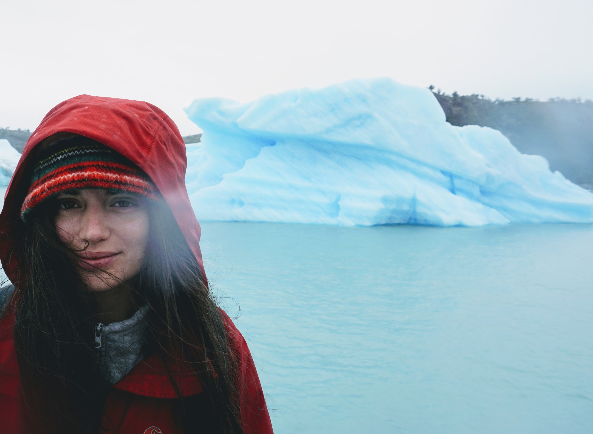

    

        I am an evolutionary biologist and postdoctoral researcher in the department of <a href="https://ib.berkeley.edu/">Integrative Biology</a> at the <a href="http://www.sudmantlab.org/index.html">Sudmant lab</a> at UC Berkeley.
    

    

        I received my PhD in <a href="https://www.biodiv.pt/en/phd-programme/about/">Biodiversity, Genetics and Evolution</a> having been advised by <a href="https://cibio.up.pt/people/details/mrgodinho">Raquel Godinho</a> at the University of Porto, and <a href="https://nielsen-lab.github.io/">Rasmus Nielsen</a> at UC Berkeley.
    

    

        When I am not doing research, I enjoy being in close contact with nature and sharing all the amazing wonders our planet has to offer with the people I love.I was born in Portugal, and I speak fluently portuguese from Portugal and Brazil, English, Spanish and a bit of French. Feel free to contact me in any of these languages.
    

    

